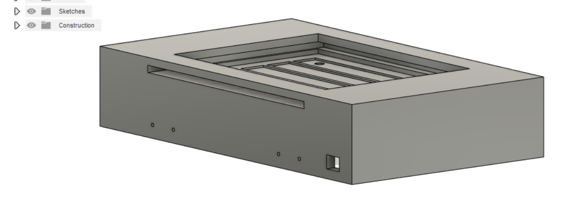

## Magic Box
This is a repo for a project I did. It was a magic box with leds that looks pretty that I made for friends. This repo has the CAD, electronics schematics and parts, and software, in case you want to build a MagicBox.  
You can see a video demo of the box [here](https://youtu.be/j3EilW4_J5o).  
  
  
  

This project was composed of:
* Hardware
  * circuit design and implementation for the electronics and lights
  * mechanical design and implementation for how the box would fit together, hinge, and diffuse light
* Software
  * Software for the state machine to control the box and its modes
  * Software for the animations for the lights
* Design
  * Design for the box to make it look pretty in terms of materials and asthetics
  * Design for small pieces to solder weld to the top of the box, like music notes, the moon, Ganesha, and other small pieces
  
If you want to make this project I'd recommend you start with the circuit, make it on perfboard and upload the code and make sure it works. Then move on from there to printing the box.

## How Did I Build This

### Planning
I started with the planning, doing some sketches and thinking through the bill of materials and the phases of this project. I knew I wanted to build something like a pretty jewelry box with lights in the lid that could do animations. After that idea I figured I would use WS2812b leds and an Arduino Nano for the electronics. I also decided I wanted to be able to change the light colors at runtime, so I needed to add buttons, push buttons.  

With these ideas I realized I would need to do some hinges. I thought about 3d printing hinges but I thought they may not last with the friction of moving back and forth, so I decided to buy metal hinges. I found a set on Amazon of pretty antique brass hinges as well as pretty clasps and decorative corner pieces.  

From there I started doing some sketches for what I wanted it to look like. You can see those below...  
  
  

### Circuits
From here I moved on to the circuit design. I initially wanted to make a PCB for this as I want to learn more about PCB design and simplify wiring, but I had a time crunch for this project of 2 weeks and didnt have time to learn and order PCBs, so I used perfboard.  

The main ideas are that the Arduino Nano is running everything, there is a micro USB port for power which is shared to the Nano and Lights, and there are two momentary push buttons that serve as input, and three status LEDs driven by PWM from the nano so that we can control the color of the WS2812b LEDs by visualy incrementing the intensity of the status LEDs inside the box.  
  

You can find the schematic in the ecad folder in an eagle format, though I did it in Fusion360.  

Heres what the circuits came out looking like:  
  
  

### Box Design
There were a couple mechanical problems I had to solve. The first one was how to mount the perfboard to the lid, and how to mount the LEDs to the lid. I decided I would attach the perfboard to the underside of the LID, and make it so that the LID was a bit hollow inside to fit the electronics. Then the LEDs would mount on top of the lid in a slight recession.  
  
  

I then knew I needed something to diffuse the LEDs so that they would look nicer and the animations would be more flowy. I found some mysterious acryllic/plexiglass on amazon and asked a friend if it was easy to cut to size. He told me about a method involving repeated scoring with a knife, then breaking it over an edge that worked quite well. That said, I had to figure out how to attach the acryllic. I ended up settling on a slot built into the lid that I would slide the acryllic into, on top of the LEDs. This worked pretty well, but the support was a pain to remove given how i printed and designed it...  
  
  

### Box Printing
I had some nice rainbow fillament I bought for this project, and I initially was quite keen on the color gradiant being continuous from the box to the box lid. This meant I had to print the lid in a specific orientation that was tough to generate supports for.

  

I made two boxes and I discovered some trouble in some parts of the design that I corrected for the second one, but I had so much time crunch that for the second one I put aside the gradient matching from bottom to lid to speed up print time. It still came out nice though.  

### Assembly
The assembly took a fair amount of time as the WS2812b needed to be soldered and wired to each other in the orientation I wanted them in the top of the box. I also hadnt done holes for self tapping screws before, I usually make the hole a bit bigger than the screw and use a captive knut. So, the first print the holes were a little too small and I ended up cracking the print a little.  

I also used an interesting technique to attach small decorative pieces to the top of the lid. I put the piece on top of the lid in the place I wanted it, then used a soldering iron around the edges. Both pieces are PLA which melts easily, and so its kind of like welding the two pieces together. It worked nicely.

### Software
The software was pretty interesting too. I had a friend doing a project to refactor a state machine, so I quizzed him on some best practices and he ended up being pretty influential in the skeleton for how the state machine works in terms of defining functions that return the next state, and an enumeration of states. I got this state machine working, with my friends help, on the raw circuit without the WS2812b LEDs early on in the project which gave me confidence moving forward.  

From there I just had to do some animations for the lights. I ended up doing some design in the light_patterns.ods file in the planning_documents folder in this repo. I knew the size of my pixel array, so I did some prototyping of animations in the worksheet using cells as pixels.  

I knew I wanted a big heart (friend getting married), scrolling text for each of their names, and a mode that would help them set colors of the LEDs. You can find the software in the magic_box_arduino_code folder.

### Scrolling Text
Each letter is represented by a 5 by 3 pixel matrix. I did the matrix illustrations in the light_patterns.ods file in this repo. [This](http://sticksandstones.kstrom.com/appen.html) is the source for the numbers used to corespond to text letter definitions. I used ASCII codes for lower case letters, even though the letters are uppercase when they scroll.